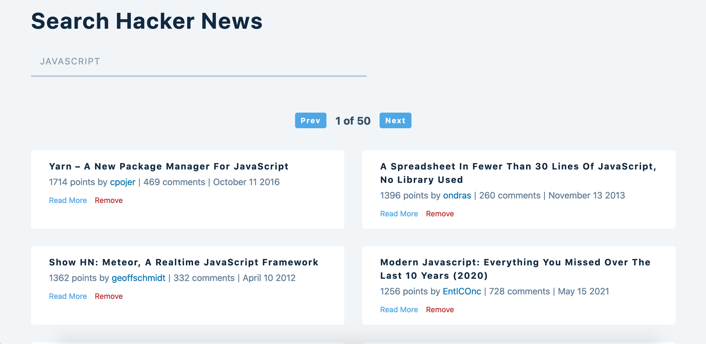

# Hacker News Search

## My process

### Built with

<a href="https://developer.mozilla.org/en-US/docs/Glossary/HTML5" target="_blank" rel="noreferrer"></a>

- Semantic HTML5 markup
- CSS custom properties
- CSS Grid & Flexbox
- JavaScript
- React.js ⚛️
- HN Search API by Algolia

### What I learned

In this project, I worked with the Hacker News Search API provided by Algolia to create a HN search app.

To make this app work, I used useContext hook to create common data that can be accessed in multiple components. I also used useReducer to manage multiple states to keep track of data coming from the API. I also used a custom hook called `useGlobalContext` for sending prop data from useContext.

The API takes `'https://hn.algolia.com/api/v1/search?'` as endpoint, and on top of that, I used two parameters `query` & `page` to fetch relevant posts & to get the page number of the feed respectively.

By default, I have set it to fetch Hacker News posts related to `JavaScript` keyword.

When the input field is empty, we pulled data from `https://hn.algolia.com/?q=""` and it displays the most popular Hacker News posts of all time.

### Demo

[Demo](https://webster-hn-search.netlify.app/)

### Screenshot:

---

#### Hacker News API

[Hacker News Search API Docs](https://hn.algolia.com/api)
